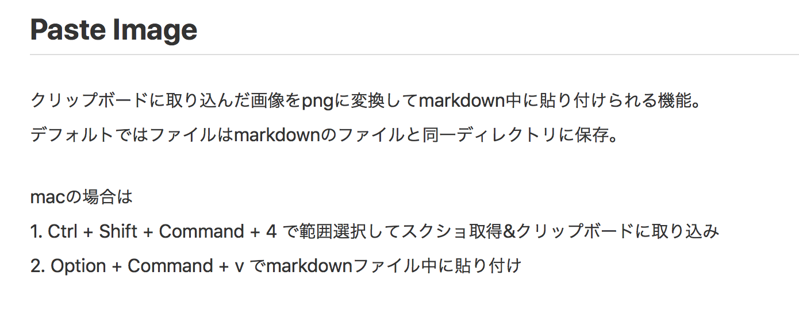

# 見出し1

## 見出し2
### 太字
この部分だけ**太字**にできる
ショートカットは command + B

### 取り消し線
この部分だけ~~取り消し線~~にできる
ショートカットは option + s

### 見出しの変更
ショートカット shift + ctrl + [／] で設定できる

### リスト
リストは * じゃなくて - で書く
Tab（shift + Tab）でインデントできる。VS Code のショートカットも使えるので、快適にインデントが設定可能っぽい

- リスト1
    - リスト1-1
    - リスト1-2
        - リスト1-2-1
        - リスト1-2-2
- リスト2
    - リスト2-1

番号付きリストは勝手に採番してくれる。
移動やインデントもだいたいいい感じに対応してくれる。これならほぼOneNoteと同じ感覚で書けそう。

1. あは
    1. あはは
2. いひ
3. うふ
    1. うふふ
        1. うふふふ
        2. うふふふ
    2. うふふ
4. えへ

### テーブル
| 項目1 | 項目2 |
| ----- | ----- |
| あは  | いひ  |


### チェックリスト
プレビューからチェックが付けられる！

- [ ] タスク1
    - [x] タスク1-1
    - [ ] タスク1-2
        - [ ] タスク1-2-1
- [ ] タスク2
- [ ] タスク3

### ショートカット
@import "test.csv"

## Paste Image で貼り付けてみる


## コード
```bash {cmd=true}
ls .
```

```javascript {cmd="node"}
const date = Date.now()
console.log(date.toString())
```
